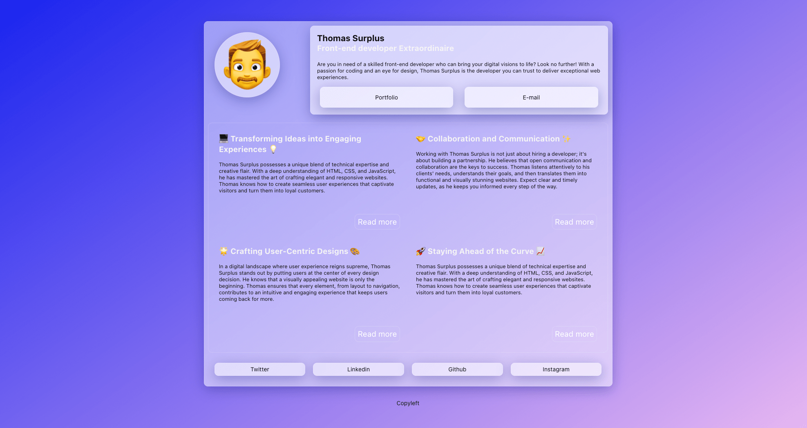

# Thomas Surplus : Glassy v-card

An exercise amongst exercises

A flexbox v-card using glassmorphism style.

### Live link

[v-card live link](https://noodles4u.github.io/v-card/)

### Screenshot

### Resources used

[Glassmorphism Generator](https://hype4.academy/tools/glassmorphism-generator)
